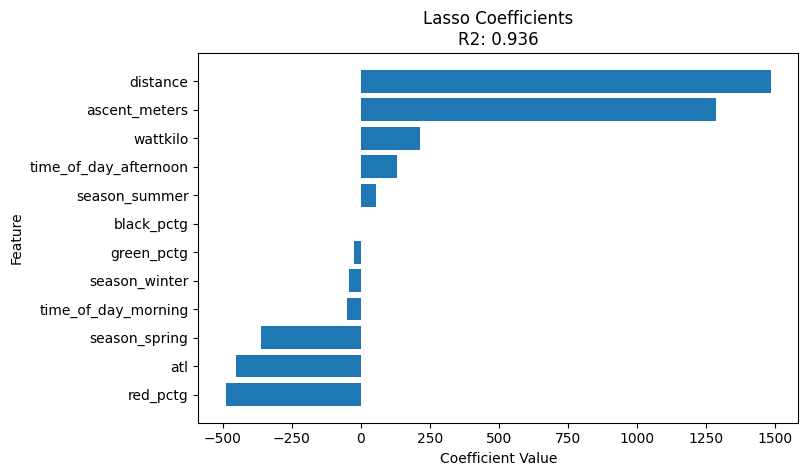
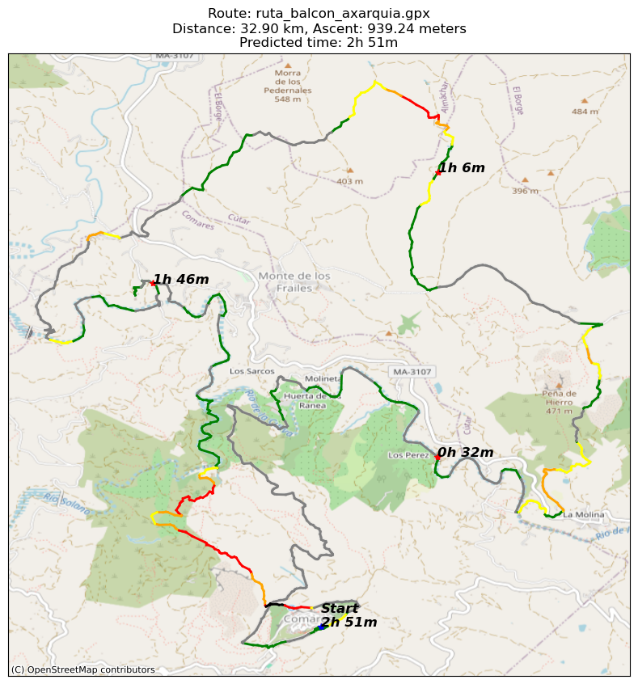
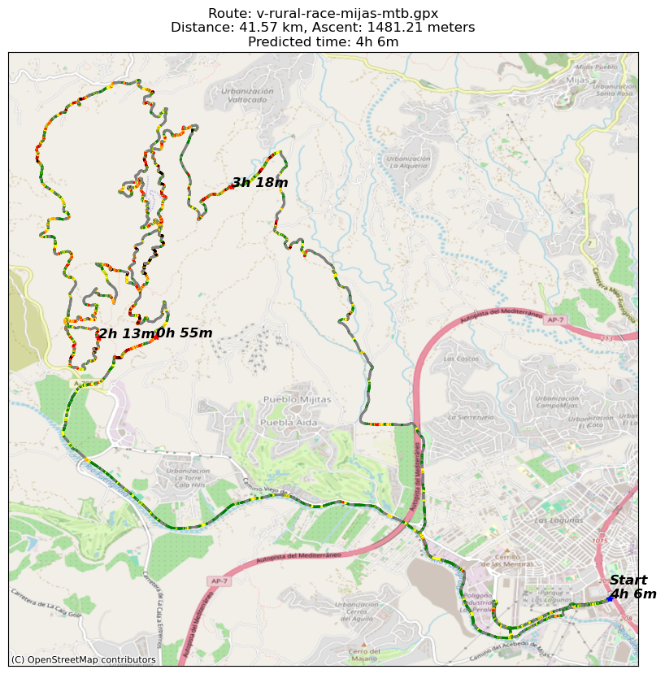

# mtb-IA

Make predictions about your MTB rides!

# Route completion time prediction

## Data Preprocessing

The data preprocessing is handled in several scripts that prepare the raw data for further processing and training.

1. **Decompressing Strava Dump**: The `strava_dump_decompressor.py` script decompresses all .gz files in the `strava_export` folder and saves them in the `strava_export/decompressed` folder.

2. **Processing TCX and FIT files**: The `strava_activity_processor.py` script processes all TCX and FIT files in the `strava_export/decompressed` folder and saves them as CSV files in the `processed_activities` folder.

3. **Loading and Preprocessing Activity Files**: The `preprocess.py` script in the `data` folder loads all activity files from the `processed_activities` folder. It keeps only the necessary columns, sorts the data by timestamp, and saves the preprocessed data to the `processed_activities.csv` file.

4. **Fetching Wellness Data**: The `intervals.py` script fetches wellness data from intervals.icu and saves it to the `wellness.csv` file. The wellness data includes the athlete's Acute Training Load (ATL), Chronic Training Load (CTL), and power-to-weight ratio.

## Training

### Preprocessing

The preprocessing of the MTB rides data is handled in the `preprocess.py` script. This script reads the raw data, processes it, and prepares it for training the models.

The script performs the following steps:

1. **Read the raw data**: The script reads the raw data from the `processed_activities.csv` file. This file contains all the waypoints of all the rides in the Strava dump.

2. **Process the activities**: The script applies the `process_activity_by_id` function to all the activities. This function processes an activity by calculating the slope, altitude difference, elapsed time, season, time of day, and slope color for each waypoint in the activity.

3. **Aggregate the waypoints**: The script aggregates all the waypoints of an activity to a single row per activity. It calculates the maximum distance, total ascent, maximum elapsed time, most common season, most common time of day, and the percentage of each slope color in the activity per total distance.

4. **Merge with wellness data**: The script merges the processed activities with the wellness data, which includes the athlete's Acute Training Load (ATL), Chronic Training Load (CTL), and power-to-weight ratio (wattkilo).

5. **Save the preprocessed data**: The script saves the preprocessed data to the `preprocessed.csv` file. This file is used for training the models.

To preprocess the data, run the `preprocess.py` script. You can adjust the parameters of the preprocessing at the top of the script.

### Training the Regressor

The training of the regressor is handled in the `train_regressor.py` script. This script reads the preprocessed data,
prepares it for training, and then trains various regression models on it. The models currently supported are Ridge, SVR
Linear, SVR RBF, Lasso, and ElasticNet.

The script uses a pipeline to preprocess the data and train the model. The preprocessing step includes standard scaling
for numerical features and one-hot encoding for categorical features. The training step uses GridSearchCV for
hyperparameter tuning.

The script splits the data into a training set and a test set. The model is trained on the training set, and its
performance is evaluated on the test set. The performance metrics used are Mean Squared Error (MSE), Mean Absolute
Error (MAE), and R-squared (R2).

After training, the script saves the model, its performance metrics, and its coefficients to the `model_stats`
directory. It also plots the coefficients of the model.

To train a regressor, run the `train_regressor.py` script. You can adjust the parameters of the models and the features
used for training at the top of the script.

These are the coefficients of the model:

## Making Predictions

The prediction of the completion time for a given MTB route is handled in the `predict.py` script. This script uses the trained models to predict the time it will take to complete a route based on the distance and elevation information.

The script performs the following steps:

1. **Ingest the GPX file**: The script reads a GPX file which contains the waypoints of the route.

2. **Process the GPX data**: The script calculates the distance, slope, and altitude difference for each waypoint in the route. It also calculates the total distance and ascent of the route.

3. **Search for the best models**: The script searches for the top models by R2 score in the `model_stats` directory.

4. **Make predictions**: For each of the top models, the script makes a prediction of the completion time for the route. It also makes predictions for the completion time of the first quarter, second quarter, and third quarter of the route.

5. **Plot the route**: The script plots the route on a map, with the slope of the route color-coded. It also plots the start point, the end point, and the quarter points on the map, and annotates them with the predicted completion times.

To make a prediction, run the `predict.py` script with the path to the GPX file as an argument. You can adjust the parameters of the models and the features used for prediction at the top of the script.

## Plots

## Plots

The `predict.py` script generates a plot for each route prediction. These plots provide a visual representation of the route, with the slope of the route color-coded. The start point, the end point, and the quarter points of the route are also plotted on the map, and annotated with the predicted completion times.

The plots are saved in the `model_stats` directory, with the name of the route and the suffix `_prediction.png`.

The plot includes the following elements:

1. **Route Line**: The route is plotted as a line on the map. The color of the line indicates the slope of the route, with different colors representing different slope categories.

2. **Start Point**: The start point of the route is marked with a blue asterisk. The predicted completion time for the entire route is annotated next to the start point.

3. **Quarter Points**: The quarter points of the route (i.e., the points at 25%, 50%, and 75% of the total distance) are marked with red asterisks. The predicted completion times for these points are annotated next to the asterisks.

4. **End Point**: The end point of the route is marked with a green asterisk.

5. **Background Map**: The plot includes a background map for context. The map is sourced from OpenStreetMap.

Here are some examples of the plots generated by the script:

